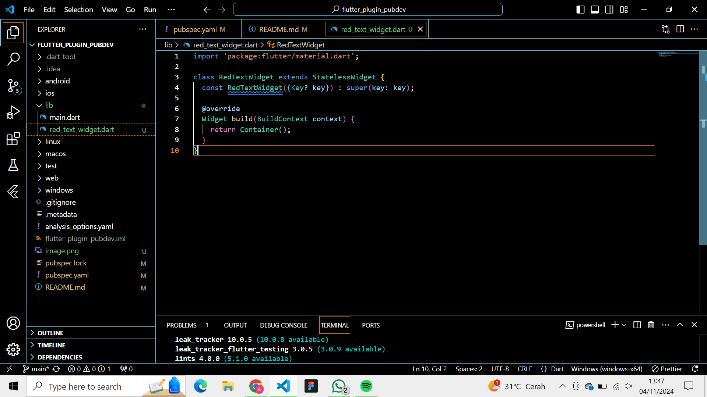

Menambahkan Plugin

Membuat file red_text_widget.dart

Menambah widget AutoSizeText

Saya mendapatkan info error karena method AutoSizeText() belum didefinisikan dan properti text juga belum didefinisikan
Berikut adalah kode yang sudah dibenarkan

Menambahkan widget di main.dart

Hasil menggunakan plugin camera

Hasil menggunakan filter
